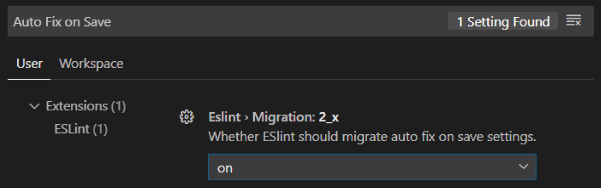

## Django Project

### Python/Django Version

파이썬 3.8 이상의 최신 안정버전을 계속 추적해서 사용해주세요. 장고 프레임워크를 통한 파이썬 개발이기에 파이썬 버전을 올리는 것에 대해서는 대개 호환성 이슈가 없을 것입니다. 릴리즈된 안정버전은 늦어도 1년 내에 적용하기를 추천드립니다.
장고 역시 최신 안정버전을 사용해주세요. 그래야만 다양한 버그패치나 새로운 기능들을 빠르게 적용할 수 있습니다. 릴리즈된 안정버전은 늦어도 1년 내에 적용하기를 추천드립니다.

### Package Manager

개발환경에서는 Anaconda Python을 사용하고, 가상환경으로 Conda Environment를 사용하고, 팩키지 매니저로 Conda와 pip를 혼용해서 사용해주세요. Conda 팩키지가 있다면 이를 먼저 사용하고 없다면 pip 팩키지를 쓰는 것이 오류를 줄일 수 있습니다.
리눅스 배포 환경에서는 각 OS의 기본 파이썬 배포판을 활용해주시고, 가급적 최신 버전을 사용하시는 것이 보안 위험을 낮추실 수 있습니다.

### Proejct Create

django 라이브러리를 설치하면 django-admin 명령이 설치됩니다. 다음과 같이 프로젝트를 생성하실 수 있습니다.

```bash
# 라이브러리 설치
pip install django

# 프로젝트 생성 (방법1)
django-admin startproject 프로젝트명

# 프로젝트 생성 (방법2)
python -m django startproject 프로젝트명
```

django-admin 대신에 python -m django 명령을 대신 사용할 수도 있습니다. Django를 설치했음에도 django-admin 명령을 사용할 수 없다면 대신 사용해보세요. 이는 환경변수 PATH 설정이 꼬였을 가능성이 높습니다.

### Database Migration

장고를 통한 최대의 생산성은 ORM을 사용하는 것에 있습니다. RDB 데이터베이스는 데이터저장소로 보시고, 주요 비즈니스 로직은 장고 ORM인 “장고 모델”에 그 의도를 최대한 녹여내어 주세요.
그리고, 데이터베이스 스키마 변경이력 관리를 해야만 합니다. 별도의 소프트웨어를 쓸 수도 있겠지만, 장고의 장점을 최대한 뽑아내기 위해서 장고의 데이터베이스 마이그레이션 기능을 필히 적용해주세요.

---

## React Project

### NodeJS Version

노드JS에는 LTS (Long Term Support) 시스템이 있습니다. 최신 버전의 LTS 버전을 설치해서 사용해주세요. Create-react-app을 통한 개발이기에 노드JS 버전을 올리는 것에 대해서는 대개 호환성 이슈가 없을 것입니다.

### Package Manager

Nodejs 기본 팩키지 매니저인 npm를 쓰지 않고, 개선된 팩키지 매니저인 yarn을 사용합니다. Yarn은 다음 명령으로 설치할 수 있습니다. Yarn 설치 시에만 npm 명령을 사용합니다.

```bash
Shell> npm install --global yarn
```

### Project Create

프로젝트는 항상 create-react-app (이하 CRA) 툴을 사용하여 생성합니다.

```bash
# 프로젝트 생성
yarn create react-app 프로젝트명

# 개발서버 구동
cd 프로젝트명
yarn start
```

CRA를 쓰는 대표적인 장점은 다음과 같습니다.

1. 단 하나의 One build dependency를 가지게 되므로, 리액트 프로젝트를 구성할 때 필요한 webpack/babel/eslint 등 간의 설정에 대해서 신경쓰지 않아도 됩니다.
2. Autoprefixer를 지원해주기에, 일반적인 CSS 코드 생성을 하게 되면 자동으로 -webkit-, -ms- 등의 prefixer를 자동으로 적용해줍니다.

### 절대 **_yarn eject_**를 하지 않습니다.

CRA에서는 webpack을 비롯한 여러 설정들이 숨겨져있습니다. 이러한 설정들을 재정의하기 위해 yarn eject 명령으로 숨겨진 webpack 설정들을 끄집어내어 커스텀하고 싶은 유혹에 빠질 수 있습니다. Eject를 하게 되면 더 이상 CRA 애플리케이션이 아니게 되며, 설정을 최소화하고 애플리케이션에 집중할 수 있는 CRA의 장점이 사라지게 됩니다. 한 번 Eject를 하게되면 이전 상태로 돌아갈 수 없습니다.

1. CRA의 모든 Configuration을 직접 유지보수해야 합니다 (webpack/babel/eslint 등).
2. One build dependency의 장점을 잃어버리게 됩니다. 하나의 팩키지가 추가/업데이트/삭제할때마다 항상 다른 팩키지들과의 의존성을 신경써야 합니다.
   커스텀 설정이 필요하다면, customize-cra와 react-app-rewired 팩키지를 사용하여 재정의해주세요. 하지만 이 두 팩키지를 쓰더라도 CRA가 가지는 안정성을 절대적으로 보장해주는 것은 아니기에 조심스럽게 사용해주세요.

---

## Code Formattings

### Python Code Formatting

파이썬 공식 스타일 가이드 PEP8 (Python Enhance Proposal) 문서를 기본으로 채택합니다. 대표적인 코딩 컨벤션은 다음과 같습니다.

- Indent는 공백 4칸을 사용한다.
- 함수와 함수 사이에 빈줄을 2줄 둔다.
- Line length는 최대 79.
- 각각의 import들은 comma로 연결하지 않고, 별도의 라인으로 나눈다.

이 외에도 수많은 코딩 컨벤션들이 있지만, 이를 모두 외우고 적용하는 것은 무척이나 어려운 일입니다. 이를 자동으로 검사해주는 도구가 있으며, 코드를 체크만 해주는 Style Checker와 체크한 결과를 가지고 변경까지 해주는 Formatter로 나눌 수 있습니다.

### 프로젝트 가상환경을 확인해주세요.

아래 pylint/black은 pip 명령으로 설치할 수 있으며, 설치 후에 명령행에서 관련 명령을 사용할 수 있습니다. 이에 앞서 먼저 가상환경을 생성/활성화한 후에 수행해주세요.

```bash
# 가상환경 활성화
shell> conda activate 가상환경명

# 설치
shell> pip install black
```

### Visual Studio Code에서의 환경설정

VSCode Extension 중에 필히 Python (Microsoft) 확장을 설치해주셔야만, VSCode에서 다양한 파이썬 지원을 받으실 수 있습니다.


```
View 메뉴 -> Command Palette … 메뉴 -> Python: Select Interpreter
```

위 메뉴를 통해 사용하실 가상환경을 지정해주세요. 그래야만 VSCode에서 그 가상환경 내에 설치되어있는 유틸리티를 활용하실 수 있습니다.


```
File 메뉴 -> Preferences 메뉴 -> Settings 메뉴를 열고, 우상단 “Open Settings (JSON)”
```

아이콘을 눌러, JSON 환경설정 화면으로 진입해주세요.


환경설정은 하나의 JSON 입니다. JSON 문법에 맞게, 최상위 중괄호({}) 안에 아래 설정을 추가해주세요. 아래 내용 그대로 복사해서 설정에 붙여넣으시면 안 됩니다. JSON은 마지막 설정값 끝에는 콤마가 붙지않음에 유의해주세요.
이제 필요한 설정을 JSON 환경설정 파일에 직접 편집하실 수 있습니다. 물론 Settings에 대한 GUI도 지원되지만, JSON 편집이 보다 직관적입니다.

### Pylint

Style checking, Error checking, 리팩토링과 관련된 조언과 함께 코드에 점수도 매겨줍니다.
pip 명령으로 설치할 수 있으며, 설치 후에 명령행에서pylint 명령을 사용할 수 있습니다. 이에 앞서 먼저 가상환경을 생성/활성화한 후에 수행해주세요.

```bash
# 설치
shell> pip install pylint

# 수동 수행 : 하지만 VSCode에 의해 자동 수행되기에 직접 수행할 필요는 없습니다.
shell> pylint <소스 파일/디렉토리 경로>
```

VSCode 기본에서 lint 설정이 활성화되어있기 때문에 별도 설정없이도 아래와 같이 lint가 수행이 됩니다.


위 소스파일을 명령행에서 직접 실행할 경우, 다음과 같이 수행이 됩니다.


### Black

파이썬 소프트웨어 재단(PSF)에서 개발하고 PEP8을 기반으로 가독성이 더 좋은 코드 스타일로 고쳐주는 자동 포맷터입니다. Black 말고도 autopep8과 yapf도 있습니다만 black이 좀 더 적극적으로 코드 스타일을 교정하는 편입니다.
Black은 공식 GitHub에서 Uncompromising Code Formatter (타협하지 않는, 단호한의 의미) 라고 소개하고 있으며, 개발자가 코드 스타일을 고치기 위해 고민하고 결정하는 시간을 절약할 수 있고, 코드 스타일로 생기는 사소한 갈등을 방지해서 더 중요한 문제 해결에 집중할 수 있도록 도와줍니다.
pip 명령으로 설치할 수 있으며, 설치 후에 명령행에서 black 명령을 사용할 수 있습니다. 이에 앞서 먼저 가상환경을 생성/활성화한 후에 수행해주세요.

```bash
# 설치
shell> pip install black

# 수동 수행 : 하지만 VSCode에 의해 자동 수행되기에 직접 수행할 필요는 없습니다.
shell> black <소스 파일/디렉토리 경로>
```

VSCode에서 변경된 코드를 저장할 때마다 black이 자동으로 실행토록 할 수 있습니다.
첫번째 설정은 코드 저장 시마다 자동으로 포맷팅을 하기 위함이고, 두번째 설정은 VSCode의 기본 포맷터 대신에 black을 사용한다는 것입니다.

```json
"editor.formatOnSave": true,
"python.formatting.provider": "black",
"python.formatting.blackArgs": []
```

프로젝트 차원에서 포맷팅이 되지 않은 코드를 커밋하는 것을 방지하는 것이 바람직합니다. Git hook스크립트를 실행해주는 pre-commit 팩키지를 설치해주세요.

```bash
pip install pre-commit
```

프로젝트 최상단에 .pre-commit-config.yaml 파일을 다음 내용으로 생성해주세요.

```yaml
repos:
  - repo: https://github.com/psf/black
    rev: stable
    hooks:
      - id: black
```

다음 pre-commit 명령을 실행하여, 본 스크립트를 설치해주세요.

```bash
shell> pre-commit install
pre-commit installed at .git/hooks/pre-commit
```

이제 git commit 시마다 black을 통한 체크가 이뤄집니다. 체크에 실패할 경우 커밋은 실패하고 black이 소스코드를 포맷팅을 해줍니다. 변경된 파일을 git add 후에 다시 커밋하시면 됩니다.

```bash
shell> git commit -m "커밋 메세지"

[INFO] Initializing environment for https://github.com/psf/black.
[INFO] Installing environment for https://github.com/psf/black.
[INFO] Once installed this environment will be reused.
[INFO] This may take a few minutes...
black....................................................................Failed
- hook id: black
- files were modified by this hook

reformatted test.py
All done! \u2728 \U0001f370 \u2728
1 file reformatted.
```

커밋할 때마다 black에 의해 자동으로 포맷팅이 검사되고 필요 시에 포맷팅을 수행해주기 때문에, 코드 에디터에 자동 포맷팅 설정을 해놓지 않은 개발자도 자연스럽게 Black을 통해 일관적인 코드 스타일을 유지할 수 있습니다.

### React Code Formatting

일반적으로 JS 표준 스타일은 다음과 같은 규약이 적용됩니다.

1. 들여쓰기에는 공백 2개합니다.
2. 문자열에 작은 따옴표 사용합니다.
3. 미사용 변수는 정의하지 않는다.
4. 예약어 뒤에 공백을 추가합니다.
5. 함수 선언 괄호 앞에 공백 추가합니다.
6. == 대신 ===를 사용합니다.
7. 공백 사이에 연산자 넣기
8. 쉼표 뒤에 공백이 있어야 합니다.
9. Else 구문은 중괄호와 같은 줄에 둬야 합니다.
10. 여러 줄의 if 구문을 사용할 경우 중괄호를 사용해야 합니다.
11. 함수에 매개변수 err가 있을 경우 항상 처리해야 합니다.
12. 브라우저 전역 접두어인 window를 붙어야 합니다. 다만 document, console, navigator를 사용할 경우 생략할 수 있습니다.
13. 여러 줄의 공백을 허용하지 않습니다.
14. Var 선언의 경우 하나씩 선언해야 합니다.
15. 조건부 할당은 추가적으로 괄호로 묶습니다.
16. 한 줄을 중괄호로 처리할 경우 공백을 추가합니다.
17. 변수와 함수의 이름은 Camel Case를 사용합니다.
18. eval()은 사용금지.

위와 같은 규약을 일일에 기억하고 체크하고 포맷팅을 맞추는 것은 어려운 일입니다. 이를 도와주는 대표적인 툴로서 ESLint와 Prettier가 있습니다. Visual Studio Code 가 JavaScript/TypeScript로 개발된 툴이니만큼 JavaScript에 대한 지원이 좋습니다.

### ESLint


VSCode 설정에서 ESLint auto fix on save 옵션을 켜주시면 저장할 때마다 자동으로 ESLint가 수행됩니다.



### Prettier

위 파이썬의 black처럼 정해진 규칙에 따라 자동으로 코드 스타일을 정리해주는 도구입니다. 본디 Prettier도 black처럼 명령행에서 설치/실행할 수 있지만, VSCode에서 확장으로 설치했다면 따로 설치할 필요는 없습니다.


대신 Prettier에 대한 설정을 위해, 프로젝트 루트 경로에 .prettierrc 파일 (파일명이 점(.)으로 시작합니다.)을 다음과 같이 생성해주세요.

```json
{
  "singleQuote": true,
  "semi": true,
  "useTabs": false,
  "tabWidth": 2,
  "trailingComma": "all",
  "printWidth": 80
}
```

각 설정은 다음과 같습니다.

- 문자열을 사용할 때에는 홑따옴표를 사용합니다.
- 코드는 항상 세미콜론으로 끝나야 합니다.
- 탭 대신에 스페이스를 사용합니다.
- 들여쓰기는 2칸입니다.
- 객체나 배열을 작성할 때, key/value의 끝에도 쉼표를 붙입니다.
- 한 줄이 80칸이 넘지 않도록 합니다.

JavaScript 포맷터로서 Prettier로서 사용할 것이기에, 디폴트 JavaScript 포맷터를 비활성화합니다.


이제, 포맷터를 수행하고 싶을 때마다 “Format Document” 명령을 수행하면 Prettier가 수행됩니다.


매번 “Format Document” 명령을 수행하는 것은 번거로우니, VSCode 설정에서 “Format On Save” 옵션을 켜주시면 저장할 때마다 자동으로 Prettier가 수행됩니다.


