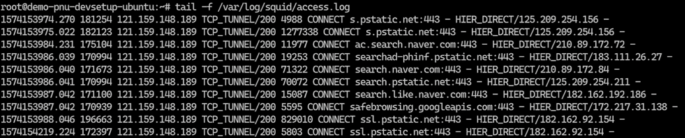

최근의 소프트웨어 개발툴킷들은 미러링이 불가능한 공용 저장소를 운영하는 경우가 있습니다. 대표적인 예로서 Visual Studio Code의 Extension이 되겠습니다. Ubuntu Linux를 지원하는 대표적인 프록시 서버로 Squid가 있습니다. 프록시 서버의 Well Known Port는 3128입니다.
프록시 서버를 설치할 머신에서 다음 명령을 수행해주세요. 이 머신은 외부 네트워크가 열려있어야 합니다.

```bash
sudo apt-get update && sudo apt-get install squid
```

설정파일 (/etc/squid/squid.conf) 에서 http_access의 디폴트 설정은 다음과 같습니다.

```bash
# Recommended minimum Access Permission configuration:
#
# Deny requests to certain unsafe ports
http_access deny !Safe_ports

# Deny CONNECT to other than secure SSL ports
http_access deny CONNECT !SSL_ports

# Only allow cachemgr access from localhost
http_access allow localhost manager
http_access deny manager

# We strongly recommend the following be uncommented to protect innocent
# web applications running on the proxy server who think the only
# one who can access services on "localhost" is a local user
#http_access deny to_localhost

#
# INSERT YOUR OWN RULE(S) HERE TO ALLOW ACCESS FROM YOUR CLIENTS
#

# Example rule allowing access from your local networks.
# Adapt localnet in the ACL section to list your (internal) IP networks
# from where browsing should be allowed
http_access allow localnet

# And finally deny all other access to this proxy
http_access deny all
```

위 설정에서 “http_access allow localnet” 설정을 제거하고, “http_access allow all” 설정을 추가해주세요. 이는 로컬네트워크 내에서의 프록시 접근을 모두 허용한다는 설정입니다. 네트워크 설정에 맞춰 다양하게 설정하실 수 있습니다.
http_access allow localnet
http_access allow all

Squid 서비스를 재시작시켜주세요. 변경한 설정에 오류가 있을 경우 재시작에 실패할 수 있습니다. 출력 메시지를 필히 확인해주세요.
sudo systemctl restart squid.service

Squid Access Log 로그 경로는 /var/log/squid/access.log 입니다. “tail -f 경로” 명령으로 접근 로그를 확인하실 수 있습니다.


