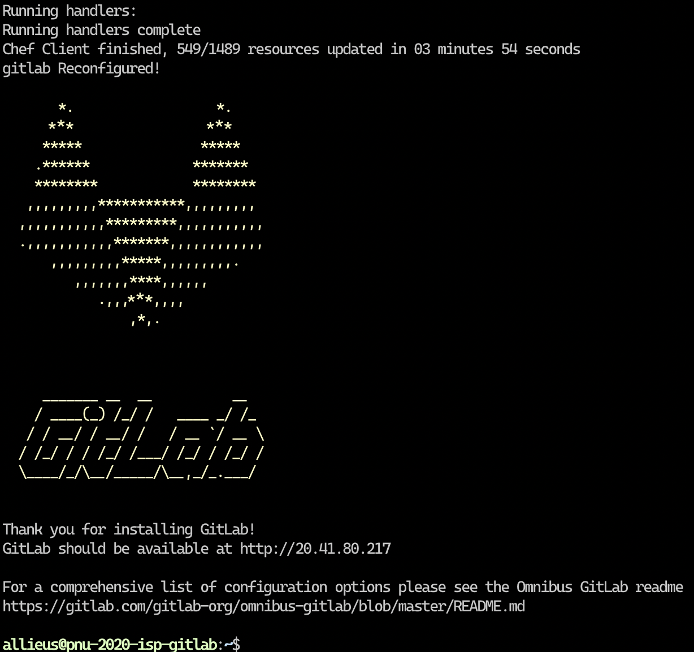
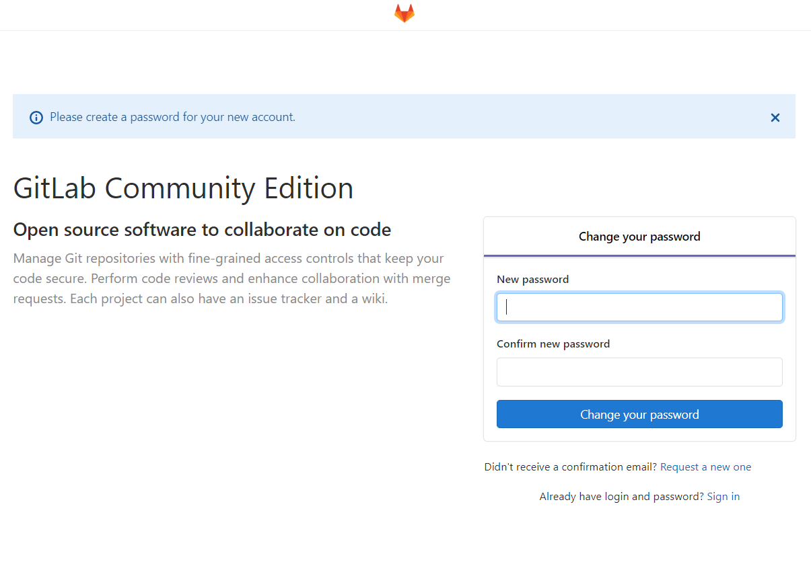

## Ubuntu 환경에 GitLab Install

GitLab은 Ruby on rails로 개발된 Git 저장소 기능, 이슈 트래커, CI/CD 기능 등을 제공해주는 소프트퉤어입니다. GitHub와 유사한 기능들이 많으며, 설치 팩키지도 제공되기에 폐쇄 네트워크에서도 구축할 수 있습니다.

GitLab 구동을 위해 서버 메모리가 최소 6GB가 필요합니다. 메모리 8GB 설정을 추천합니다. 4GB 미만으로 설정할 경우 메모리 부족으로 시스템이 멈출 수도 있습니다.

GitLab 목적으로 쓰는 머신은 GitLab + GitLab Runner만 구축하여 사용하시기를 권장드립니다.

다양한 리눅스 배포판에 설치할 수 있지만, 우분투 리눅스가 최신 버전을 가장 빠르게 지원하므로 우분투 리눅스 사용을 권장합니다. 공식 설치문서는 https://about.gitlab.com/install/#ubuntu 입니다.

아래 명령을 수행하기 전에, 미리 GitLab 서버의 도메인 주소를 미리 할당하고 나서, 아래의 EXTERNAL_URL 부분에 지정해주세요. https를 지정한다면 무료 https 인증서 서비스인 Let’s Encrypt 프로세스를 자동으로 수행하여 https 인증서를 설치해줍니다.

```bash
# 필수 의존성 패키지를 설치합니다.
sudo apt-get update && sudo apt-get install -y curl openssh-server ca-certificates

# 이메일 알림을 위해 postfix 설치가 필요하며, 추가로 외부 SMTP 서버 설정이 필요합니다.
sudo apt-get install -y postfix

# GitLab 팩키지 저장소 추가 및 의존성있는 팩키지 설치
PACKAGE_URL=https://packages.gitlab.com/install/repositories/gitlab/gitlab-ee/script.deb.sh
curl $PACKAGE_URL | sudo bash

# GitLab EE 설치
sudo EXTERNAL_URL="https://gitlab.example.com" apt-get install gitlab-ee
```

설치가 완료되면 아래와 같은 화면으로 완료됩니다.


설치 완료 후 지정한 호스트로 웹페이지에 접속해보면 아래와 같이 Gitlab 페이지가 나타납니다.
패스워드를 지정하면 Default **_username_**은 **_root_**입니다.

