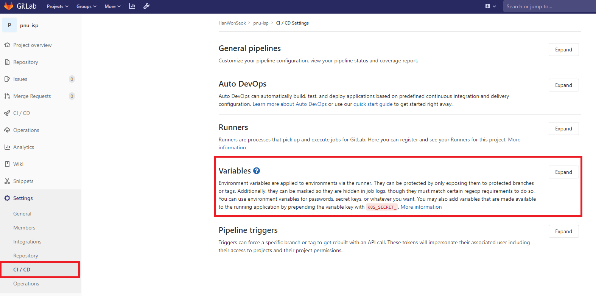
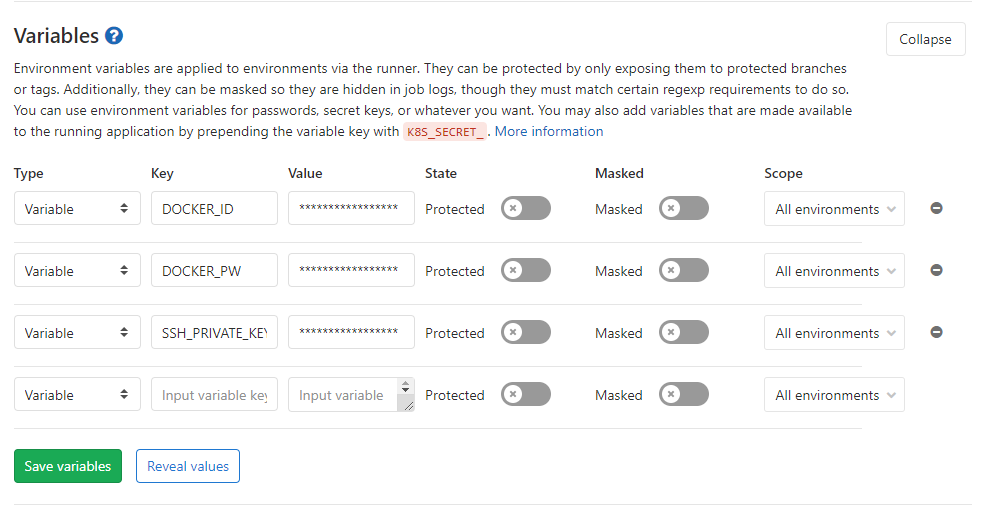

## CI/CD

[CI/CD(지속적 통합/지속적 제공): 개념, 방법, 장점, 구현 과정](https://www.redhat.com/ko/topics/devops/what-is-ci-cd)

`CI`는 개발자를 위한 자동화 프로세스인 `지속적인 통합(Continuous Integration)`을 의미합니다.

CI를 성공적으로 구현할 경우 애플리케이션에 대한 새로운 코드 변경 사항이 정기적으로 빌드 및 테스트되어 공유 리포지토리에 통합되므로 여러 명의 개발자가 동시에 애플리케이션 개발과 관련된 코드 작업을 할 경우 서로 충돌할 수 있는 문제를 해결할 수 있습니다.

`CD`는 `지속적인 서비스 제공(Continuous Delivery)` 및/또는 `지속적인 배포(Continuous Deployment)`를 의미하며 이 두 용어는 상호 교환적으로 사용됩니다. 두 가지 의미 모두 파이프라인의 추가 단계에 대한 자동화를 뜻하지만 때로는 얼마나 많은 자동화가 이루어지고 있는지를 설명하기 위해 별도로 사용되기도 합니다.

- `지속적인 제공`이란 개발자들이 애플리케이션에 적용한 변경 사항이 버그 테스트를 거쳐 리포지토리(예: GitHub 또는 컨테이너 레지스트리)에 자동으로 업로드되는 것을 뜻하며, 운영팀은 이 리포지토리에서 애플리케이션을 실시간 프로덕션 환경으로 배포할 수 있습니다.
- `지속적인 배포(또 다른 의미의 "CD": Continuous Deployment)`란 개발자의 변경 사항을 리포지토리에서 고객이 사용 가능한 프로덕션 환경까지 자동으로 릴리스하는 것을 의미합니다. 이는 애플리케이션 제공 속도를 저해하는 수동 프로세스로 인한 운영팀의 프로세스 과부하 문제를 해결합니다

`CI/CD`는 파이프라인으로 표현되는 실제 프로세스를 의미하고, 애플리케이션 개발에 지속적인 자동화 및 지속적인 모니터링을 추가하는 것을 의미합니다.

---

## CI/CD Tools

CI/CD를 구축할 수 있는 TOOL에는 다음과 같은 종류들이 있고, 그 이상으로 많이 있습니다.

- GitLab
- Jenkins
- circleci
- Travis CI

---

## .gitlab-ci.yml

[GitLab CI/CD Pipeline Configuration Reference](https://docs.gitlab.com/ee/ci/yaml/README.html)

---

## 변수 설정

해당 프로젝트의 `Settings - CI/CD`로 이동하여 `Variables`의 Expand를 클릭하여 화면을 확장해줍니다.

아래와 같이 변수명과 값을 설정할 수 있습니다.





### 1. 구성요소

- `stages` : 스테이지 별로 작업이 실행된다.각 스테이지의 작업 중 하나라도 실패하면 pipeline의 표시가 failed로 뜬다. 스테이지 명을 따로 정의하지 않으면 build, test, deploy로 기본 값이 배정된다.
- `variables` : .gitlab-ci.yml파일에서 사용 될 변수 와 값의 정의
- `cache` : 후속 실행 사이에 캐시되어야하는 파일 목록 (cache:paths, cache:key, cache:untracked, cache:policy)
- `test` : Job 이름
- `stage` : 해당 Job이 실행되는 스테이지의 이름. 같은 스테이지에 해당하는 것들은 Job이 달라도 병행 실행된다(parallel). Job에 스테이지를 따로 지정하지 않으면 그 Job은 test 스테이지다.
- `image` : CI를 위해 Docker가 실제로 사용하는 image의 이름이다. 이미지는 Docker Hub에 올라와 있는 것만 사용 가능하지만 gitlab-runner/config.toml 설정을 바꿈으로써 로컬 이미지도 사용 가능 하다.
- `script` : gitlab-runner exeucutor가 실행할 명령들. script는 모든 Job에 항상 포함되어야 한다.
- `services` : job 실행 중 실행되는 Docker 이미지, 이 이미지로 생성되는 컨테이너는 line 1의 이미지와 연결된다. docker:dind 는 도커 컨테이너 안에서 또 다시 컨테이너를 사용 할 수 있게 해 준다(Docker in Docker의 약자).docker로 gitlab-runner CI를 구성했기 때문에 이 서비스를 사용한다.
- `artifacts` : 성공시 작업에 첨부할 파일 및 디렉토리 목록 (artifacts:paths, artifacts:name, artifacts:untracked, artifacts:when, artifacts:expire_in, artifacts:reports, artifacts:junit 사용 가능)

---

## .gitlab-ci.yml Sample(React)

### 설정 셋업 단계

```yaml
stages:
  - test
  - build
  - deploy

# 추가로 필요한 변수 선언
variables:
  FRONTEND: frontend
  FRONTEND_VERSION: 1
```

### Sample Stage #1 Test

```yaml
frontend-test:
  stage: test
  image: node:12
  only:
    - master
  script:
    - yarn add create-react-app jest jest-junit
    - cd frontend
    - yarn test:junit
  artifacts:
    when: always
    expire_in: 1 week
    paths:
      - ./react-result.xml
    reports:
      junit:
        - ./react-result.xml
```

### Sample Stage #2 Build

```yaml
frontend-build:
  stage: build
  image: node:12
  only:
    - master
  script:
    - echo frontend build start
    - echo $DOCKER_PW | docker login -u "$DOCKER_ID" --password-stdin
    - docker build -f ./frontend/Dockerfile-dev -t $DOCKER_ID/$FRONT:$FRONT_VERSION ./frontend/
    - docker push $DOCKER_ID/$FRONTEND:latest
    - echo frontend build end
```

### Sample Stage #3 Deploy

```yaml
frontend-deploy:
  stage: deploy
  image: ubuntu:18.04
  only:
    - master
  before_script:
    - "which ssh-agent || ( apt-get update -y && apt-get install openssh-client -y )"
    - mkdir -p ~/.ssh
    - eval $(ssh-agent -s)
    - '[[ -f /.dockerenv ]] && echo -e "Host *\\n\\tStrictHostKeyChecking no\\n\\n" > ~/.ssh/config'
    - ssh-add <(echo "$SSH_PRIVATE_KEY")
  script:
    - echo frontend deploy start
    - ssh -o StrictHostKeyChecking=no hws@$SSH_HOST docker login -u $DOCKER_ID --password $DOCKER_ORG_PW
    - ssh -o StrictHostKeyChecking=no hws@$SSH_HOST "FRONT_IMAGE=$DOCKER_ID/$FRONTEND:$FRONTEND_VERSION" \\
      "FRONT_NAME=$FRONTEND" \\
      sh /home/hws/isp_frontend.sh
    - echo frontend deploy start
```

---

## .gitlab-ci.yml Sample(Django)

### 설정 셋업 단계

```yaml
stages:
  - test
  - build
  - deploy

# 추가로 필요한 변수 선언
variables:
  BACKEND: backend
  BACKEND_VERSION: 1
```

### Sample Stage #1 Test

```yaml
backend-test:
  stage: test
  image: python:3.8
  only:
    - master
  script:
    - echo pytest start
    - pwd
    - pip install -r ./backend/requirements.txt
    - python ./backend/manage.py test
    - pytest --junit-xml=./pytest_result.xml
    - echo pytest end
  artifacts:
    when: always
    expire_in: 1 week
    paths:
      - ./pytest_result.xml
    reports:
      junit:
        - ./pytest_result.xml
```

### Sample Stage #2 Build

```yaml
backend-build:
  stage: build
  image: docker:19.03.1
  only:
    - master
  before_script:
    - docker info
  script:
    - echo backend build start
    - echo $DOCKER_PW | docker login -u $DOCKER_ID --password-stdin
    - docker build -f ./backend/Dockerfile-dev -t $DOCKER_ID/$BACKEND:$BACKEND_VERSION ./backend/
    - echo lineline
    - docker push $DOCKER_ID/$BACKEND:$BACKEND_VERSION
    - echo backend build end
```

### Sample Stage #3 Deploy

```yaml
backend-deploy:
  stage: deploy
  image: ubuntu:18.04
  only:
    - master
  before_script:
    - "which ssh-agent || ( apt-get update -y && apt-get install openssh-client -y )"
    - mkdir -p ~/.ssh
    - eval $(ssh-agent -s)
    - '[[ -f /.dockerenv ]] && echo -e "Host *\\n\\tStrictHostKeyChecking no\\n\\n" > ~/.ssh/config'
    - ssh-add <(echo "$SSH_PRIVATE_KEY")
  script:
    - echo backend deploy start
    - ssh -o StrictHostKeyChecking=no hws@$SSH_HOST docker login -u $DOCKER_ID --password $DOCKER_ORG_PW
    - ssh -o StrictHostKeyChecking=no hws@$SSH_HOST "BACK_IMAGE=$DOCKER_ID/$BACKEND:$BACKEND_VERSION" \\
      "BACK_NAME=$BACKEND" \\
      sh /home/hws/isp_backend.sh
    - echo backend deploy start
```
