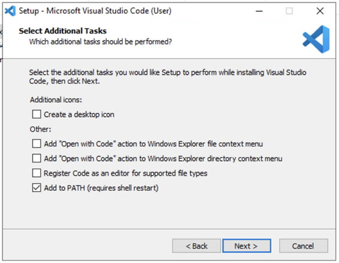

## Chocolatey를 통한 설치

명령프롬프트나 파워쉘에서 다음 명령을 통해 설치할 수 있습니다.

```bash
choco install vscode
```

---

## 직접 다운로드를 통한 설치

아래 “직접 다운로드를 통한 설치” 스크린샷에서 보여지는 대개의 옵션이 디폴트 활성화되어있습니다.

공식 사이트 (https://code.visualstudio.com/)에서 OS에 맞게 설치 파일을 다운받아서, 원하는 옵션으로 설치해주세요. 옵션없이 설치하셔도 무방합니다.

1. Create a desktop icon : 바탕화면에 아이콘 생성
2. Add “Open with Code” action to Windows Explorer file context menu : 윈도우탐색기에서 파일 열기 메뉴
3. Add “Open with Code” action to Windows Explorer Directory context menu : 윈도우탐색기에서 폴더열기 메뉴
4. Register Code as an editor for supported file types : 지원하는 파일타입에 대해 디폴트 에디터로 등록하기
5. Add to PATH (required shell restart) : 명령행에서 code 명령으로 VSCode를 구동할 수 있습니다.



---

## Proxy 설정

외부 네트워크가 막힌 개발환경에서 Visual Studio Code의 Extension을 검색/설치할려면 Proxy 설정이 필요합니다. 명령행에서 아래 명령을 통해 VSCode 프록시 서버를 설정하실 수 있습니다. 경로명은 설치환경에 따라 달라질 수 있습니다.

```bash
# 윈도우의 경우
"C:\Program Files\Microsoft VS Code\Code.exe" --proxy-server="프록시서버주소:3128"

# 맥/리눅스의 경우
code --proxy-server=" 프록시서버주소:3128"
```
