## 주요 용어

1. Docker 프로젝트 소스코드 : 소프트웨어를 팩키징하는 단위의 프로젝트 루트폴더를 뜻합니다. Docker 팩키징을 위해서 하나 이상의 Dockerfile이 필요합니다. Dockerfile에는 Docker 팩키징에 필요한 명령들을 나열합니다.
2. Docker Image : Docker 프로젝트를 빌드한 결과입니다. 소프트웨어를 포함하는 읽기 전용 이식 가능 팩키지이며, 운영체제를 포함합니다.
3. Docker Registry : Docker Image 저장소. Public한 저장소 서비스로서 Docker Hub가 있으며, Docker Registry 서버를 직접 띄워서 비공개 저장소를 운영할 수도 있습니다. 로컬에서 빌드한 Docker Image를 docker push 명령으로 특정 Registry 서버로 전송할 수 있습니다.
4. Docker Container : Docker Image를 통해 구동된 Docker Instance이며, 하나의 Image로부터 다수의 Instance를 구동할 수 있습니다.
5. Container Orchestration : 다수의 Container의 시작 및 중단시점 제어, 클러스터로 그룹화, 애플리케이션을 구성하는 모든 과정을 관리할 수 있습니다. 관리자는 상태 모니터링, 장애 조치 절차를 자동화할 수 있습니다. 이러한 툴로서 Docker Swarm, Google Kubernetes, Apache Mesos 등이 있습니다.

---

## DockerSwarm

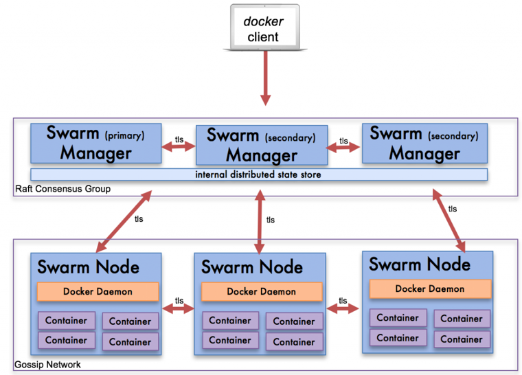

Docker Swarm은 Docker에서 직접 제공하는 Container Orchestration 툴이며, Docker Engine에 Ochestration Layer를 구현하여, Cluster 관리 및 Cluster에 배포되는 Container들에 대한 Resource, Network, Security, Fault Torelance등 Ochestartion 기능을 사용할 수 있게 해줍니다

Docker Swarm은 수많은 컨테이너 오케이스트레이션 도구 중 하나로, 여러 대의 Docker 호스트들을 마치 하나인 것처럼 만들어주는 Orchestration 도구입니다. Docker 엔진에서 직접적으로 지원해주는 Feature입니다.
기본적으로 Docker Swarm은 Manager노드와 Worker 노드로 시스템을 구성합니다. Manager노드는 클러스터 관리 작업을 하고 클러스터 상태 유지, 스케줄링 서비스, Swarm HTTP API Endpoint를 제공합니다. Worker 노드는 컨테이너를 실행하는 역할만 합니다.

다수의 Node를 묶어서 클러스터를 구성합니다. 예시에서는 다음과 같이 VM을 구성하겠습니다.

1. Manager (Leader)
2. Manager
3. Worker

### 공통 수행

클러스터로 구성할 각각의 Manager/Node 머신에서 아래 명령을 통해 docker 서비스를 설치해주세요. 아래 명령은 Ubuntu 18.04 LTS 기준입니다.

```bash
# 팩키지 업데이트, 오래된 버전 제거 및 Docker 설치
sudo apt-get update && \
 sudo apt-get remove docker docker-engine docker.io && \
 sudo apt install -y docker.io

# 도커 설치 및 서비스로 등록
sudo systemctl start docker
sudo systemctl enable docker
```

설치된 Docker 서비스와 /var/run/docker.sock을 통해 통신을 하게 되는 데, 이 파일의 소유자/그룹이 root/docker이며 권한이 660 이므로 일반 유저는 docker 명령을 수행하면 다음과 같은 권한거부(Permission denied)메시지를 만나게 됩니다.

```bash
shell> docker ps

Got permission denied while trying to connect to the Docker daemon socket at unix:///var/run/docker.sock: Get http://%2Fvar%2Frun%2Fdocker.sock/v1.40/containers/json: dial unix /var/run/docker.sock: connect: permission denied
```

매번 sudo를 붙여 root권한으로 docker 명령을 수행하거나, 현재 user를 docker그룹에 추가할 수도 있습니다.

```bash
# 현재 접속중인 사용자에게 권한을 부여하여, sudo 없이도 docker 명령을 수행할 수 있게 합니다.
# 이는 로그아웃 후에 다시 로그인을 하면 적용이 됩니다.
shell> sudo usermod -aG docker \$USER

# 다시 로그인 후에, sudo없이 Docker ps 수행 가능합니다.
shell> docker ps
CONTAINER ID IMAGE COMMAND CREATED STATUS PORTS NAMES
```

### Manager (Leader)

Manager가 될 머신 1대에서 다음 명령으로 Cluster를 시작합니다.

```bash
# Case #1) 서버 IP가 하나일 경우
shell> docker swarm init
Swarm initialized: current node (jboekcu2twd0ll5b7smc8orsx) is now a manager.

To add a worker to this swarm, run the following command:

    docker swarm join --token SWMTKN-1-104fdc33l1q3j5n2monp15luuoodn1v7sp7hfd78dp9mx9g2i3-1puf4wiupj7tk2pcd10wyo2zl 10.0.3.4:2377

To add a manager to this swarm, run 'docker swarm join-token manager' and follow the instructions.
```

만약, 서버가 IP를 다수 가지고 있을 때에는, 클러스터로 묶을 네트워크 상의 아이피를 --advertise-addr 인자로 지정해서 명령을 수행해줍니다.

```bash
shell> docker swarm init --advertise-addr 노출할IP
```

### 다른 Manager 머신들

위 “공통 수행” Docker 설치 명령을 먼저 수행해주세요. Manager(Leader) 머신과 같은 네트워크 상에 존재해야만 합니다. Manager(Leader) 머신에서 다음 명령으로 manager join 명령을 알아내실 수 있습니다. 아래 출력은 예시일 뿐 그대로 복사해서 실행하진 마세요. 명령에는 token값과 manager(leader)의 아이피/포트가 있으며, 여러분 환경에 따라 달라집니다.

```bash
shell> docker swarm join-token manager

To add a manager to this swarm, run the following command:

    docker swarm join --token SWMTKN-1-104fdc33l1q3j5n2monp15luuoodn1v7sp7hfd78dp9mx9g2i3-cyqvjcch7ylucikex7obvg5d8 10.0.3.4:2377
```

위 명령의 출력 결과를 새로운 Manager 머신에서 수행해주시면 Manager JOIN 처리가 완료됩니다.

```bash
shell> docker swarm join --token MANAGER목적으로*복사한*토큰값 MASTER주소및포트

This node joined a swarm as a manager.
```

### Worker 머신들

위 “공통 수행” Docker 설치 명령을 먼저 수행해주세요. Manager(Leader) 머신과 같은 네트워크 상에 존재해야만 합니다. Manager(Leader)머신에서 다음 명령을 node join 명령을 알아내실 수 있습니다. 아래 출력은 예시일 뿐 그대로 복사해서 실행하진 마세요. 명령에는 token값과 manager(leader)의 아이피/포트가 있으며, 여러분 환경에 따라 달라집니다.

```bash
shell> docker swarm join-token worker
To add a worker to this swarm, run the following command:

    docker swarm join --token SWMTKN-1-104fdc33l1q3j5n2monp15luuoodn1v7sp7hfd78dp9mx9g2i3-1puf4wiupj7tk2pcd10wyo2zl 10.0.3.4:2377
```

위 명령의 출력 결과를 새로운 Node 머신에서 수행해주시면 Node JOIN 처리가 완료됩니다.

```bash
shell> docker swarm join --token NODE목적으로*복사한*토큰값 MASTER주소및포트

This node joined a swarm as a node.
```

다음 명령으로 노드 현황을 파악할 수 있습니다.

```bash
shell> docker node ls

ID HOSTNAME STATUS AVAILABILITY MANAGER STATUS ENGINE VERSION
jboekcu2twd0ll5b7smc8orsx \* pnu-isp-portainer-manager-1 Ready Active Leader 19.03.6
v660lkqqbd3tied08snnroqbq pnu-isp-portainer-manager-2 Ready Active Reachable 19.03.6
rz4pcij7awgchicvb6zxghmag pnu-isp-portainer-worker-1 Ready Active 19.03.6
```

---

## Docker Swarm Cluster Create

1개 이상의 물리머신/VM들을 묶어서 하나의 클러스터로 만듭니다. 이 클러스터는 최소 1개의 Manager와 다수의Node로 구성이 됩니다.

```bash
# Manager역할을 할 머신 상에서 아래 명령으로 클러스터를 생성합니다.
# 해당 머신이 다수의 IP를 가질 경우 --advertise-addr 옵션을 통해 특정할 수 있습니다. Node에 의해 접근할 수 있는 아이피로 지정해주세요.
# 실행하면 현 클러스터에 JOIN하기 위한 명령 안내가 출력됩니다.
shell> docker swarm init

Swarm initialized: current node (0f43e381p9uchiutn29l91hew) is now a manager.

To add a worker to this swarm, run the following command:
    docker swarm join \
    --token SWMTKN-1-5cjwwzjp2m1bbur2lvsg8wthty4rzacer25z3d1xby79nt00cm-bg8t6ju0k6lv5iy941etk9cvg \
    192.168.100.101:2377

To add a manager to this swarm, run the following command:
    docker swarm join \
    --token SWMTKN-1-5cjwwzjp2m1bbur2lvsg8wthty4rzacer25z3d1xby79nt00cm-e1n8bkrasbqx6ktv2qzj8gn6c \
    192.168.100.101:2377

# 다음 명령을 통해 Node 목록을 확인할 수 있습니다.
shell> docker node ls

위의 docker swarm join 명령에서의 token 값은 매번 달라질 수 있습니다. 위 명령을 모르겠다면 docker swarm join-token worker 명령으로 재확인할 수 있습니다.
shell> docker swarm join-token worker
To add a worker to this swarm, run the following command:

    docker swarm join --token SWMTKN-1-5cjwwzjp2m1bbur2lvsg8wthty4rzacer25z3d1xby79nt00cm-e1n8bkrasbqx6ktv2qzj8gn6c 192.168.100.101:2377

worker node역할의 머신에서 위 docker swarm join 명령을 통해 Docker Swarm 클러스터에 넣어주세요.
```

---

## Multi Manager

Docker Swarm을 Multi Manager로 구성할 경우, Manager Node의 중단시간없이 Manager Node에서 발생한 오류를 복구할 수 있습니다.

- Docker는 최대 7개의 Manager Node를 구성할 것을 권장합니다. 안정적인 서비스를 위해 필히최소 2개의 Manager를 구성해주세요.
- N개의 Manager Swarm은 최대 (N-1)/2개 Manager Node의 손실에 대해서 허용
  - 3 Manager Swarm은 최대 1개 Manager Node의 손실에 대해서 허용
  - 5 Manager Swarm은 최대 2개 Manager Node의 손실에 대해서 허용

다음 명령으로 Manager로 클러스터에 JOIN하기 위한 명령을 알아낼 수 있습니다.
shell> docker swarm join-token manager
To add a manager to this swarm, run the following command:

    docker swarm join --token SWMTKN-1-5cjwwzjp2m1bbur2lvsg8wthty4rzacer25z3d1xby79nt00cm-e1n8bkrasbqx6ktv2afabadf32 192.168.100.101:2377

---

## Docker Swarm 명령

### 서비스 생성

```bash
shell> docker service create --name mynginx -p 80:80 nginx

3dwrm1v1bno51uslv0ahekgs8
overall progress: 1 out of 1 tasks
1/1: running   [==================================================>]
verify: Service converged
```

### 서비스 목록 출력

```bash
shell> docker service ls

ID                NAME          MODE                REPLICAS        IMAGE                                       PORTS
ycnxbgk2mkl5      django        replicated          2/2             ispdemo.azurecr.io/ispdemo/professor:1.66   *:8080->80/tcp
```

### 지정 서비스에 대한 보다 자세한 정보

```bash
# docker service ps 서비스명
shell> docker service ps django

ID                 NAME           IMAGE                                       NODE              DESIRED STATE       CURRENT STATE         ERROR               PORTS
eusso5a5767m       django.1       ispdemo.azurecr.io/ispdemo/professor:1.66   isp-demo          Running             Running 2 days ago
dbv95f04yhig        \_ django.1   ispdemo.azurecr.io/ispdemo/professor:1.65   isp-demo          Shutdown            Shutdown 2 days ago
vs3ta5a7dpa3        \_ django.1   ispdemo.azurecr.io/ispdemo/professor:1.64   isp-demo          Shutdown            Shutdown 8 days ago
sna0p27yhfip       django.2       ispdemo.azurecr.io/ispdemo/professor:1.66   isp-demo          Running             Running 2 days ago
```

### 지정 서비스의 Container 수를 변경

```bash
# docker service scale 서비스명=숫자
shell> docker service scale django=2

django scaled to 2
overall progress: 2 out of 2 tasks
1/2: running   [==================================================>]
2/2: running   [==================================================>]
verify: Service converged
```

### 지정 서비스의 이미지 변경

지정 서비스 내의 모든 Container에 대해서 지정한 이미지명로 모두 변경됩니다. 여러 Replicas에 대해 일괄적으로 이미지를 변경하지 않고 순차적으로 Rolling Update를 수행하기에, 2개 이상의 Replicas가 설정되어있을 경우, 서비스 중단없이 이미지 변경이 가능합니다.

```bash
# docker service update --image 새이미지명 서비스명
shell> docker service update --image=ispdemo.azurecr.io/ispdemo/professor:1.66 django

image ispdemo.azurecr.io/ispdemo/professor:1.66 could not be accessed on a registry to record
its digest. Each node will access ispdemo.azurecr.io/ispdemo/professor:1.66 independently,
possibly leading to different nodes running different
versions of the image.

django
overall progress: 2 out of 2 tasks
1/2: running  [==================================================>]
2/2: running  [==================================================>]
verify: Service converged
```

### 지정 서비스 제거

```bash
# docker service rm 서비스명
shell> docker service rm django

django
```

### 클러스터에서 Worker Node 제외하기

명령을 수행한 Worker Node를 docker swarm 클러스터에서 제외시킵니다.

```bash
shell> docker swarm leave

Node left the default swarm
```

---

## Portainer

CLI 인터페이스가 강력하지만, 웹 GUI를 통해 보다 직관적으로 Docker Swarm 서비스를 관리할 수 있습니다. 그 중 하나가 Portainer입니다. 실행 중인 컨테이너, 설치한 이미지, 볼륨 등을 직관적으로 확인할 수 있을 뿐만 아니라, 클릭 몇 번으로 상태를 변경할 수 있고, 템플릿을 이용해 원하는 애플리케이션을 간단하게 구현할 수 있습니다.
다음 명령으로 Docker Swarm Cluster 상에 Portainer 서비스를 올릴 수 있습니다. 컨테이너 관리 서비스이기에 Constraint 설정을 두어 Manager 에 배포가 되도록 하여야만 합니다. Portainer 이미지의 EXPOSE 포트는 9000입니다.

### Portainer를 컨테이너로 생성하기

```bash
docker run \\
 --name portainer \\
 -itd \\
 -p 9000:9000 \\
 -v /var/run/docker.sock:/var/run/docker.sock \\
 -v ${pwd}/data:/data \\
 portainer/portainer
```

### Portainer를 서비스로 생성하기

```bash
docker service create \\
    --name portainer \\ # 서비스의 이름은 portainer로 한다.
    --publish 9000:9000 \\ # 9000 -> 9000 포트로 바인드한다.
    --replicas=1 \\ # replica를 1개만 서비스한다.
    --constraint 'node.role == manager' \\ # manager 노드에 추가
    --mount type=bind,src=/var/run/docker.sock,dst=/var/run/docker.sock \\ # 호스트의 src 경로와 서비스의 dst 경로를 마운트한다.
    --mount type=bind,src=/portainer/data,dst=/data \\
    portainer/portainer

nyurhdw82mueq8ae7zfejwk4k
overall progress: 1 out of 1 tasks
1/1: running [==================================================>]
verify: Service converged
```

```bash
# Docker Swarm 서비스 내역
shell> docker service ls
ID NAME MODE REPLICAS IMAGE PORTS
nyurhdw82mue portainer replicated 1/1 portainer/portainer:latest \*:9000->9000/tcp
```

이제 해당 노드의 IP:9000 주소로 접속하면, 아래와 같은 화면을 만나보실 수 있습니다
username과 password를 등록합니다.

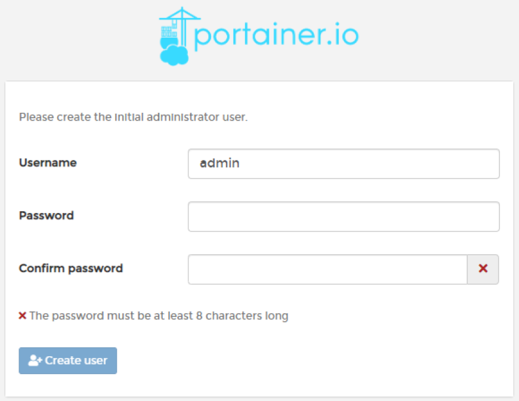

그리고 아래의 화면이 나타날텐데 Portainer를 구동하는 주체는 현재 Local 환경이기때문에 Local을 선택해줍니다.

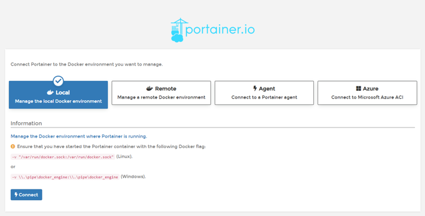

로그인 후에, Docker Swarm에서 하던 작업들을 웹GUI에서 그대로 수행할 수 있습니다.

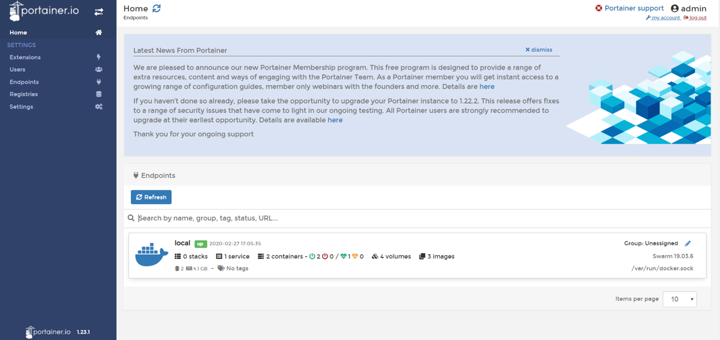

---

## Portainer에서 Service, Constainer 생성

### Service Create

Service로 이동하여 Add service버튼을 클릭합니다.

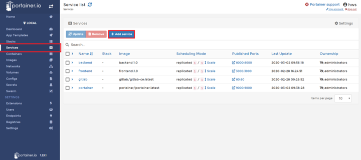

Image configuration에서 Advanced mode를 클릭하면 아래와 같이 직접 빌드한 이미지로 서비스를 생성할 수 있습니다.

- Name : Service명
- Image : 생성할 Service의 베이스 Image
- Scheduilng : 생성할 Service의 스케쥴러 수
- Port mapping : 외부에서 서비스 내부와 연결할 포트

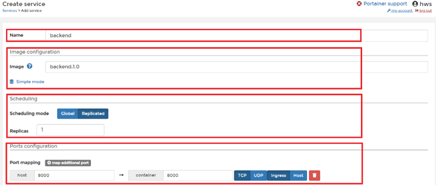

Create the service 버튼을 클릭해 서비스를 생성합니다.

- Create a service webhook : 생성할 Service에 Webhook을 사용할지를 선택한다.
- Enable access control : 해당 Servie의 관리를 특정 그룹이 제어하게 할 것이냐를 선택한다.

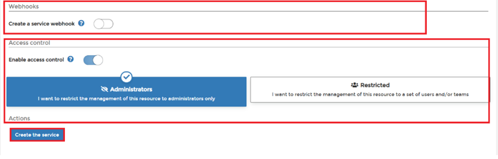

### 추가옵션

아래 내용은 Service를 생성할 때 추가적으로 적용하는 옵션입니다.

#### Command & Loggind

- Command : Service를 생성하며 실행할 명령어를 지정한다.
- Entrypoint : Command 보다 먼저 지정한 명령을 1번 실행한다.
- Working Dir : Command가 실행될 디렉토리를 지정한다.
- User : 지정한 권한
- Environment variables : 환경변수를 지정한다.
- Logging : Service의 Logging 드라이버를 설정한다.

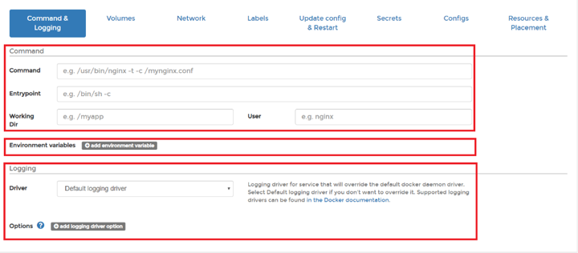

#### Volume

Volume Mount 할 폴더 또는 파일을 설정합니다.

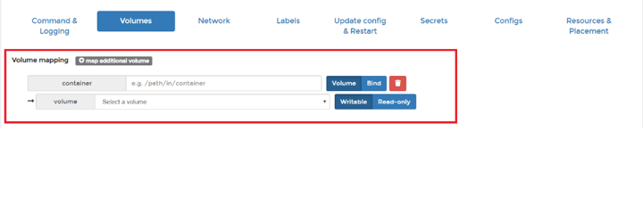

#### Network

생성하는 Service와 통신할 수 있는 Network를 설정할 수 있습니다.

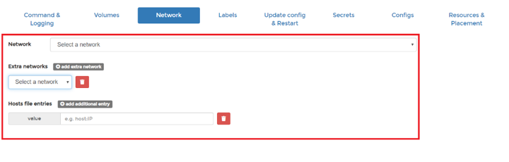

#### Labels

Label을 사용해 Service나 Container 생성자, 버젼, 날짜 등을 기록할 수 있습니다.

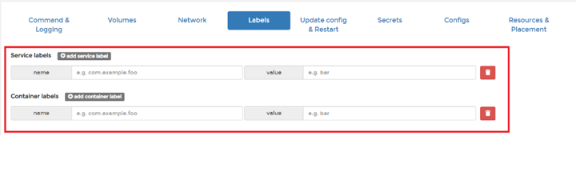

#### Config

해당 Path에 설정 파일을 위치시켜 설정을 셋팅할 수 있습니다.
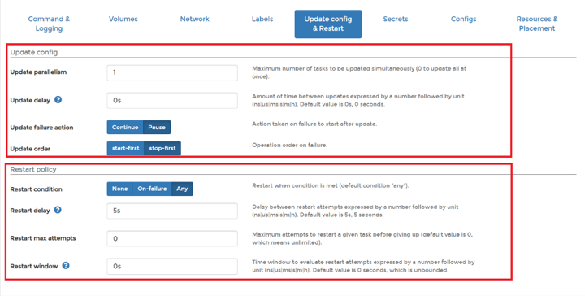

#### Update config & Restart

- Update config
- Update Parallelism : 동시에 업데이트할 최대 작업 수를 설정한다.
- Update delay : 업데이트하는데 필요한 시간을 설정한다.
- Update failure action : 업데이트 실패시 취해야할 행동을 설정한다.
- Update order : 업데이트 실패 시 작업 순서를 정한다.
- Restart policy
- Restart condition : 재시작 조건을 설정한다.
- Restart delay : 재시작에 필요한 시간을 설정한다.
- Restart max attempts : 재시작 실패시 다시 시작하는 최대 횟수를 설정한다.
- Restart window : 설정한 시간마다 재시작을 평가하는 창을 띄운다.

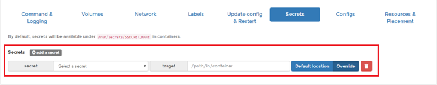

#### Secrets

Container에서 사용할 비밀값을 설정할 수 있습니다.

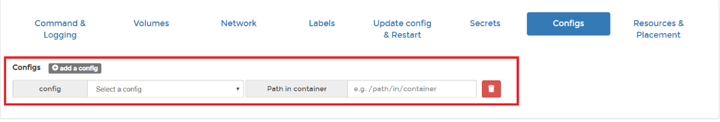

#### Resources & Placement

Service의 자원(메모리, CPU)를 관리할 수 있습니다.

- constraints : 특정한 조건을 만족하는 노드에서만 작업을 할 수 있게 모아준다.
- preferences : 특정한 조건을 만족하는 노드에서만 작업할 수 있게 배치를 고르게 분포한다.

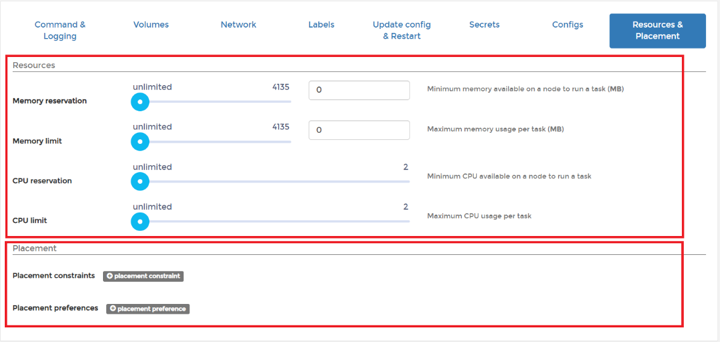

---

## 주의할 점

> Dockerfile을 통한 이미지를 빌드시에는 CLI 환경에서 빌드하고, 빌드된 이미지를 통한 서비스나 컨테이너 생성은 GUI에서 가능합니다
