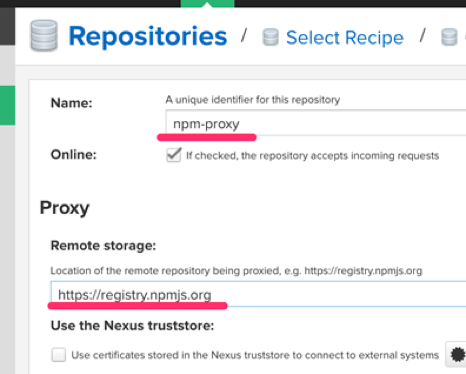

---

## Nexus3

Sonatype Inc에서 만든 다양한 저장소 (pypi, npm, maven, docker 등)를 관리하기 위한 프로젝트입니다.

## Uubuntu 18.04에 Nexus3 Install

먼저 nexus3는 Java 애플리케이션이기에 JDK가 필요합니다. JDK가 없다면 다음 명령으로 openjdk-8을 설치해주세요.

```bash
shell> sudo apt-get install openjdk-8-jdk
```

설치된 nexus3의 디폴트 설정파일은 /opt/nexus-\*/etc/nexus-default.properties 경로이며, 다음과 같습니다.

```bash
## DO NOT EDIT - CUSTOMIZATIONS BELONG IN $data-dir/etc/nexus.properties
##
# Jetty section
application-port=8081
application-host=0.0.0.0
nexus-args=${jetty.etc}/jetty.xml,${jetty.etc}/jetty-http.xml,${jetty.etc}/jetty-requestlog.xml
nexus-context-path=/

# Nexus section
nexus-edition=nexus-pro-edition
nexus-features=\
 nexus-pro-feature

nexus.hazelcast.discovery.isEnabled=true
```

위 설정에서 application-port 설정이 Nexus 3를 서비스코자 하는 웹서비스 포트 설정이며, 디폴트 8081입니다. 필요하다면 변경하셔도 되며, 본 매뉴얼에서는 디폴트 그대로 사용하겠습니다.

Nexus3를 서비스로 등록하여, OS가 부팅되면 자동 시작토록 해봅시다. /etc/systemd/system/ 경로에 nexus.service 파일을 다음과 같이 생성합니다. 아래에서 /opt/nexus-\* 경로는 nexus 버전에 따라 달라질 수 있습니다. 필히 디렉토리 명을 확인해주세요.

```bash
[Unit]
Description=nexus service
After=network.target

[Service]
Type=forking
LimitNOFILE=65536
ExecStart=/opt/nexus-3.19.1-01/bin/nexus start
ExecStop=/opt/nexus-3.19.1-01/bin/nexus stop
User=root
Restart=on-abort

[Install]
WantedBy=multi-user.target
```

다음 명령으로 systemd에 설정을 반영해줍니다.

```bash
sudo systemctl daemon-reload
sudo systemctl enable nexus.service
sudo systemctl start nexus.service
```

nexus 로그는 /opt/sonatype-work/nexus3/log/nexus.log 경로에 남습니다. tail 명령으로 아래와 같이 실시간으로 로그를 확인할 수 있습니다.

## 저장소 설정하기

웹브라우저를 통해 Nexus 3 서비스로 접속하여, pypi/npm/maven 등의 저장소 설정을 수행합니다. Nexus 3 웹서비스 포트는 위 nexus3 설정의 appliation-port 설정을 따르니 꼭 확인해주세요.
웹서비스 최초 접근 시에 admin 로그인을 요구받습니다. Admin 암호는 nexus3 설치 서버의 /etc/sonatype-work/nexus3/admin.password 경로에 있으니 확인하여 로그인해주세요. 로그인 후에 암호를 설정하실 수 있습니다.

아래와 같이 Anonymous Access에 대한 접근 설정은 허용처리하겠습니다. 참고로 Nexus3에서는 인증(Authentication)을 지원합니다.


상단 메뉴 Configuration 메뉴 -> Repositories -> Create repository 메뉴를 통해 새로운 저장소를 생성할 수 있습니다. 지원하는 Repository type은 다음과 같습니다.

- proxy : 외부 저장소 (공식 저장소 등)를 프록시합니다. 이를 통해 외부 저장소를 캐싱할 수 있습니다.
- hosted : 자체 모듈 저장소
- group : proxy와 hosted를 그룹을 묶을 수 있습니다. 그룹에 저장소를 나열하는 순서로 라이브러리 탐색 우선순위를 가집니다.
  Npm(proxy), npm(hosted), npm(group) 순서대로 할당하여 생성합니다.


Npm(proxy) 저장소는 아래와 같이 생성합니다. 이름은 구별을 위해 npm-proxy 포맷으로 지어주세요.
Remote storage 필드에 원본 저장소 주소를 지정할 수 있으며, 필드 도움말에 Npm 공식 저장소 안내가 있으니 그대로 기입하시면 됩니다.



파이썬 pypi는 아래 화면과 같습니다.


Npm(Hosted) 저장소 등록 시에는 먼저 등록한 Blob store가 있다면 설정하고 없다면 default Blob store 를 사용해주세요. 이 저장소는 실제 팩키지가 업로드되는 저장소입니다.


Npm(group) 저장소에서는 리스팅된 npm 저장소를 Members에 우선순위에 맞춰 추가해주세요.


개별 Repository의 Copy 메뉴를 통해, Group 저장소에 대한 접근 URL을 획득할 수 있습니다.


웹UI에서 라이브러리를 등록하는 기능은 제공되지 않습니다.

---

## 저장소 사용하기

### Nexus User 생성하기

Configuration -> Repositories -> Create local user 메뉴를 통해, 새로운 User를 등록/관리할 수 있습니다. Nexus 상의 저장소에 배포하기 위해서는 User 계정이 필요하니, 생성한 User가 없다면 새로이 하나 생성해주세요.

### NPM 저장소에 배포하기

프로젝트 루트 경로에서 .npmrc 파일을 다음과 같이 생성합니다. Registry 설정은 npm 저장소의 URL이며, npm-group의 URL을 지정토록 하겠습니다. \_auth는 Nexus3 서버의 계정:패스워드를 base64 인코딩으로 인코딩한 것입니다. “username:password” 문자열을 base64 인코딩으로 인코딩하면 “dXNlcm5hbWU6cGFzc3dvcmQ=” 문자열이 됩니다.

```npmrc
registry=http://nexus3-isp.pnu.askcompany.kr:8081/repository/npm-group/
_auth=dXNlcm5hbWU6cGFzc3dvcmQ=
```

Base64 인코딩 문자열은 다양한 방법으로 구하실 수 있습니다.

```bash
# 윈도우 명령 프롬프트
echo | set /p="username:password" | openssl base64

# 윈도우 파워 쉘
[convert]::ToBase64String([Text.Encoding]::UTF8.GetBytes('username:password'))

# 맥/리눅스
echo -n 'username:password' | openssl base64

# 파이썬
python -c "from base64 import b64encode; print(b64encode(b'username:password').decode('ascii'))"
```

프로젝트 내 package.json 파일 내 registry 설정에 npm(hosted) 접근 URL을 추가합니다. 설정 파일에 private: true 설정이 되어있다면 publish 명령을 거부하게 되므로 필히 삭제를 해주세요. 이 설정은 비공개적으로 사용하는 저장소를 무심코 publish하는 것을 미연에 방지해주는 설명입니다.

```json
"publishConfig": {
  "registry": "http://nexus3-isp.pnu.askcompany.kr:8081/repository/npm-hosted/",
},
"private": true
```

이제 다음 명령으로 팩키지를 배포할 수 있습니다.

```bash
명령프롬프트> yarn publish
```

### NPM 저장소를 이용하기

현재 npm 설정 내역은 다음과 같이 확인할 수 있습니다.

```bash
명령프롬프트> npm config list
; cli configs
metrics-registry = "https://registry.npmjs.org/"
scope = ""
user-agent = "npm/6.13.4 node/v12.16.1 win32 x64"

; builtin config undefined
prefix = "C:\\Users\\allieus\\AppData\\Roaming\\npm"

; node bin location = C:\Program Files\nodejs\node.exe
; cwd = C:\Users\allieus
; HOME = C:\Users\allieus
; "npm config ls -l" to show all defaults.
```

Npm 설정 파일 경로는 %USERPROFILE%\AppData\Roaming\npm\etc\npmrc 입니다. 해당 위치의 설정파일을 직접 편집할 수도 있지만, 다음의 npm config set 명령으로 손쉽게 설정할 수 있습니다.
다음 명령으로 npm 저장소의 registry 서버 주소를 지정해주세요. Npm(group) 주소를 지정했기에 npm(hosted)와 npm(proxy) 저장소를 모두 활용하게 됩니다.

```bash
npm config set --global registry http://nexus3-isp.pnu.askcompany.kr:8081/repository/npm-group
```

현재의 설정파일 내역은 다음과 같이 확인할 수 있습니다.

```bash
명령프롬프트> type %USERPROFILE%\AppData\Roaming\npm\etc\npmrc
registry=http://nexus3-isp.pnu.askcompany.kr:8081/repository/npm-group
```

registry 설정 외에 proxy 설정도 있으니, 환경에 맞게 설정해주세요.
